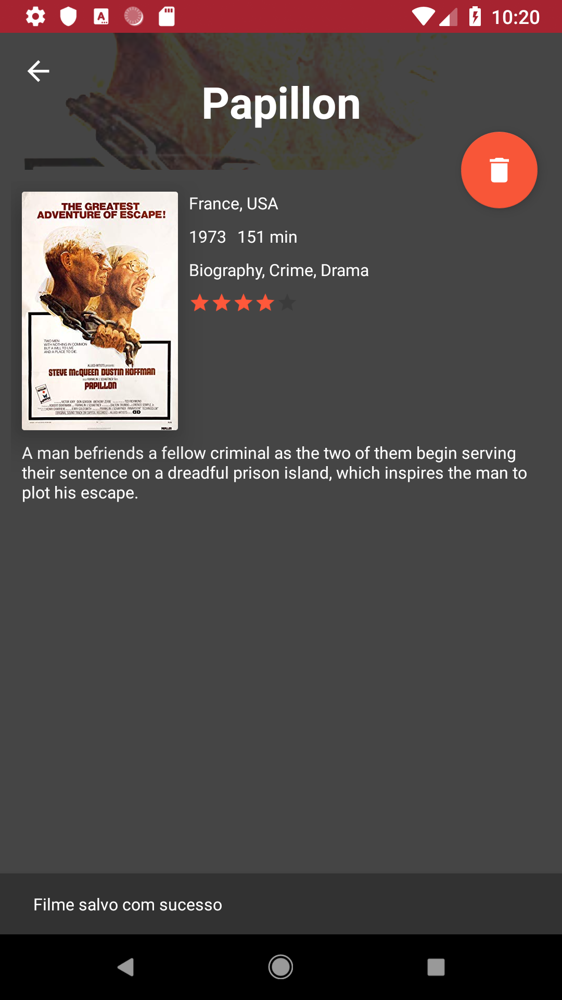

# OmdbMovieListing
Aplicativo para pesquisa de filmes cadastrados na base do Omdb
Feito em Kotlin com arquitetura MVVM

**Features:**

* Pesquisa por nome de filmes
* Salvamento para visualização offline

**Exemplo de uso:**

Pesquisa por nome de filme:

Visualização de detalhes de filme:

Salvamento de filmes:

Os filmes salvos podem ser acessados mesmo com o device offline

